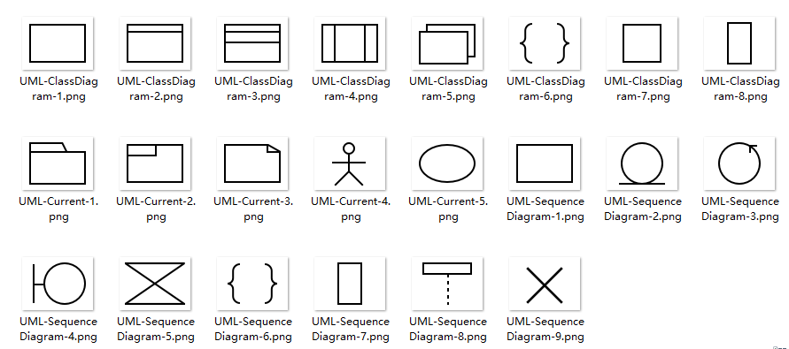

# Plugins

## panel

### 安装

```
npm install butterfly-dag butterfly-plugins-panel
```

### 用法

``` js
import panelPlugins from 'butterfly-dag/plugins';
import 'butterfly-dag/plugins/dist/index.css';

import pika from '../img/pikatest.jpg';

panelPlugins.register(
  [
    {
      root: document.getElementById('dnd'),
      canvas: this.canvas,
      type: 'uml',
      width: 40,
      height: 40,
      data: [
        {
          id: 'user-1',
          type: 'png',
          content: pika,
          with: 40,
          height: 40,
        }
      ]
    },
  ],() => {
    console.log('finish')
  }
);

```

### 初始化

``` JS
import panelPlugins from 'butterfly-dag/plugins';
import {Canvas} from 'butterfly-dag';

import pika from '../img/pikatest.jpg';

let PanelNode = panelPlugins.PanelNode;

let root = document.getElementById('dag-canvas');

this.canvas = new BaseCanvas({
  root: root,
  disLinkable: true, // 可删除连线
  linkable: true,    // 可连线
  draggable: true,   // 可拖动
  zoomable: true,    // 可放大
  moveable: true,    // 可平移
});

this.canvas.draw(
  {
    nodes: [{
      id: '1',
      top: 10,
      left: 20,
      width: 40,
      height: 50,
      roate: 45,
      content: pika,
      Class: PanelNode,
    }]
  },
  () => {
    console.log(this.canvas.getDataMap());
});

```

### 属性

#### root  _`<dom>`_    (必填)
&nbsp;&nbsp;`panel`渲染的`dom`节点

#### canvas  _`<Object>`_    (必填)
&nbsp;&nbsp;`butterfly-dag`的`canvas`

#### type  _`<String>`_    (选填)
&nbsp;&nbsp;使用那个内置的`panel`库

#### width  _`<Number>`_    (选填)
&nbsp;&nbsp;在`root`里渲染的`type`中的每个`panel`的宽度,默认`36`

#### height  _`<Number>`_    (选填)
&nbsp;&nbsp;在`root`里渲染的`type`中的每个`panel`的宽度,默认`36`

#### data  _`<Array>`_    (选填)
&nbsp;&nbsp;自定义的`panel`,会追加在最后:自定义`panel`配置主要为：

* id _`<String>`_ (必填)用于添加进画布是的id前缀

* content _`<String>`_ (必填)`PanelNode`中填充的图片(`` | 内置`UML`图片`ID`)

``` JS
// 使用内置UML图(内置`UML`图片`ID`)

this.canvas.draw(
  {
    nodes: [{
      id: '1',
      top: 10,
      left: 20,
      content: 'UML-ClassDiagram-1',
      Class: PanelNode,
    }]
  }
);

// 使用自定义(方式一)

this.canvas.draw(
  {
    nodes: [{
      id: '1',
      top: 10,
      left: 20,
      content: 'https://www.baidu.com/img/PCtm_d9c8750bed0b3c7d089fa7d55720d6cf.png',
      Class: PanelNode,
    }]
  }
);

// 使用自定义(方式二)

import pika from '../img/pikatest.jpg';

this.canvas.draw(
  {
    nodes: [{
      id: '1',
      top: 10,
      left: 20,
      content: pika,
      Class: PanelNode,
    }]
  }
);

```



*文件名即为id*：如： `UML-ClassDiagram-1`

* type _`<String>`_ (选填)后续内容，用于标示图片的类型

* width _`<Number>`_ (选填)在`root`中渲染的自定义`panel`的宽度,默认`36`

* height _`<Number>`_ (选填)在`root`中渲染的自定义`panel`的高度,默认`36`

### API

#### panelPlugins.register(data, callback)

*作用*：注册`panel`到`root`中

*参数*

* `{Array} data` 里面包含`panel`数据
* `{function} calllback`（可选） 注册完毕后的回调

``` js
// 无自定义

panelPlugins.register(
  [
    {
      root: document.getElementById('dnd'),
      canvas: this.canvas,
      type: 'uml',
    }
  ],()=>{
    console.log('finish');
  }
);

// 有自定义

panelPlugins.register(
  [
    {
      root: document.getElementById('dnd'),
      canvas: this.canvas,
      type: 'uml',
      data: [
        {
          id: 'user-1',
          type: 'png',
          content: pika,
          with: 40,
          height: 40,
        }
      ]
    }
  ]
);

// 多组

panelPlugins.register(
  [
    {
      root: document.getElementById('dnd'),
      canvas: this.canvas,
      type: 'uml',
    },
    {
      root: document.getElementById('dnd1'),
      canvas: this.canvas,
      type: 'uml',
      data: [
        {
          id: 'user-1',
          type: 'png',
          content: pika,
          with: 40,
          height: 40,
        }
      ]
    }
  ]
);
```

### 节点（PanelNode）

* 继承自`butterfly-dag`的`Node`

#### 属性

##### actived  _`<Boolean>`_ 
&nbsp;&nbsp; 控制是否激活状态（激活显示node的控制点）

##### rotatorDeg _`<Number>`_ 
&nbsp;&nbsp; 当前节点的旋转角度

#### API

##### panelNode.focus ()

*作用*： 节点变为未选中状态

```js
panelNode.focus();
panelNode.update();
```

##### panelNode.unfocus ()

*作用*： 节点变为选中状态

```js
panelNode.unfocus();
panelNode.update();
```

##### panelNode.rotate (angle)

*作用*： 节点旋转

*参数*

* `angle `_`<Number>`_ 设置节点的旋转角度（顺时针）

```js
panelNode.rotate(45);
panelNode.update();
```

##### panelNode.update ()

*作用*： 更新节点状态

```js
panelNode.focus();
panelNode.rotate(45);
panelNode.update();
```


